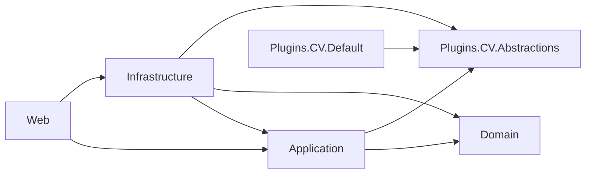
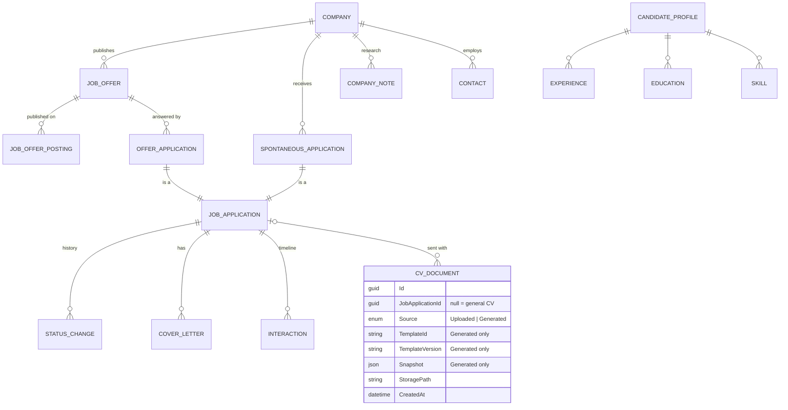
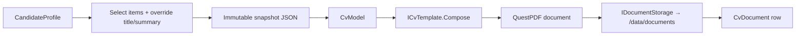

# Architecture

Ambio is a .NET 10 Blazor Web App (Interactive Server only) using ASP.NET Core Identity, EF Core with SQLite, and QuestPDF.

## Solution layout

```text
src/
  Ambio.Domain/                   Entities, value objects, domain rules — no infrastructure dependency
  Ambio.Application/              Service interfaces, DTOs, mapping extensions
  Ambio.Infrastructure/           Service implementations (EF Core via IDbContextFactory), storage, PDF, plugins, SMTP
  Ambio.Web/                      Blazor UI, Identity, composition root
  Ambio.Plugins.CV.Abstractions/  Public contract for CV template authors
  Ambio.Plugins.CV.Default/       Built-in CV template (also the reference plugin)
tools/
  Ambio.CvPlayground/             Console app + QuestPDF Companion for designing templates
tests/
  Ambio.Domain.Tests/
  Ambio.Application.Tests/
  Ambio.Infrastructure.Tests/     EF integration (SQLite in-memory), PDF snapshots
  Ambio.Web.Tests/                bUnit component tests
```

## Dependency rules



- **Domain** references nothing: no EF Core, no data annotations, no `DbContext` ([ADR 0006](adr/0006-persistence-ignorant-domain-and-dtos.md)).
- **Application** exposes services that return **DTOs**. Domain entities never reach the UI.
- **Infrastructure** implements the Application services with a short-lived `DbContext` per operation, created by `IDbContextFactory<ApplicationDbContext>`, as Microsoft recommends for Blazor Server. There are no repositories and no unit of work ([ADR 0010](adr/0010-dbcontext-factory-without-repositories.md)).
- **Infrastructure** configures persistence exclusively with `IEntityTypeConfiguration<T>` classes in `Persistence/Configurations/`, which are applied with `ApplyConfigurationsFromAssembly`.
- **Web** only consumes Application services and DTOs. It wires everything together in `Program.cs`.
- **Plugins** only reference `Ambio.Plugins.CV.Abstractions` and QuestPDF.

## Conventions

| Concern | Convention |
|---|---|
| Entity configuration | `Infrastructure/Persistence/Configurations/<Entity>Configuration.cs` implementing `IEntityTypeConfiguration<T>` |
| DTOs | `record` types in `Application/<Feature>/Dtos/` |
| Mapping | Written by hand as extension methods (`ToDto()`) in `Application/<Feature>/<Feature>MappingExtensions.cs`. No mapping library. |
| Data access | `await using var db = await dbFactory.CreateDbContextAsync(ct);` in each service method. No repositories, no unit of work. |
| Queries | LINQ projections to DTOs so EF translates them to SQL, `AsNoTracking()` for reads |
| Application URLs | `/applications/{ShortId}-{slug}`, `ShortId` generated with NanoId, looked up by `ShortId`, redirected to the canonical slug ([ADR 0014](adr/0014-short-id-and-slug-urls.md)) |
| UI tokens | Colors, typography and spacing come from `--ambio-*` CSS variables mapped onto Bootstrap. No hard-coded colors in components. See [design-system.md](design-system.md) ([ADR 0015](adr/0015-neutral-visual-identity-with-status-colors.md)) |
| UI layout | Bottom tab bar + "More" sheet below 992 px, sidebar above. Lists are tables on desktop and cards on mobile; detail pages use tabs in the URL (`?tab=`). See [ui.md](ui.md) ([ADR 0016](adr/0016-responsive-navigation-bottom-tabs-and-sidebar.md)) |
| Plugin naming | `Ambio.Plugins.<Domain>.<Purpose>` — see [plugins.md](plugins.md) |

## Data model



The company is the anchor: its profile, research notes and contacts are kept across every offer and application. An application is either an `OfferApplication` or a `SpontaneousApplication`: subtypes of an abstract `JobApplication`, mapped as one table (TPH). Fields, invariants, delete rules and persistence conventions are in **[data-model.md](data-model.md)** ([ADR 0011](adr/0011-company-centric-model-with-job-offers.md), [ADR 0012](adr/0012-archive-instead-of-delete.md)).

- **Cover letters** are plain text stored in SQLite.
- **CVs** are files on disk. `CvDocument` holds their metadata and, for generated CVs, the frozen snapshot of the data used to render them ([ADR 0007](adr/0007-cv-snapshots-selection-and-override.md)).
- A `CvDocument` without an application is a **general CV**, meant for sharing publicly.

## CV generation flow



An uploaded CV (Phase 1) skips every step up to storage: the file is validated (PDF only, size limit), stored, and recorded as `Source = Uploaded`.

## Storage layout

```text
/data
  ambio.db              SQLite database
  documents/<yyyy>/<id>.pdf
  photos/<id>.<ext>       optional profile photo
  keys/                   ASP.NET Core DataProtection keys
/plugins
  <PluginName>/<PluginName>.dll (+ dependencies)
```

See [ADR 0005](adr/0005-sqlite-and-filesystem-storage.md) for why files live on disk rather than in the database.

## Authentication

- Single user ([ADR 0002](adr/0002-single-user-application.md)): registration is closed once the account exists.
- 2FA with an authenticator app, and recovery codes.
- GitHub OAuth can only be linked to the existing account.
- Passkeys from the template are removed.
- Email is sent through SMTP (MailKit) when configured, and falls back to the no-op sender otherwise.
- `IdentityRevalidatingAuthenticationStateProvider` (from the template) revalidates the security stamp for interactive circuits.
