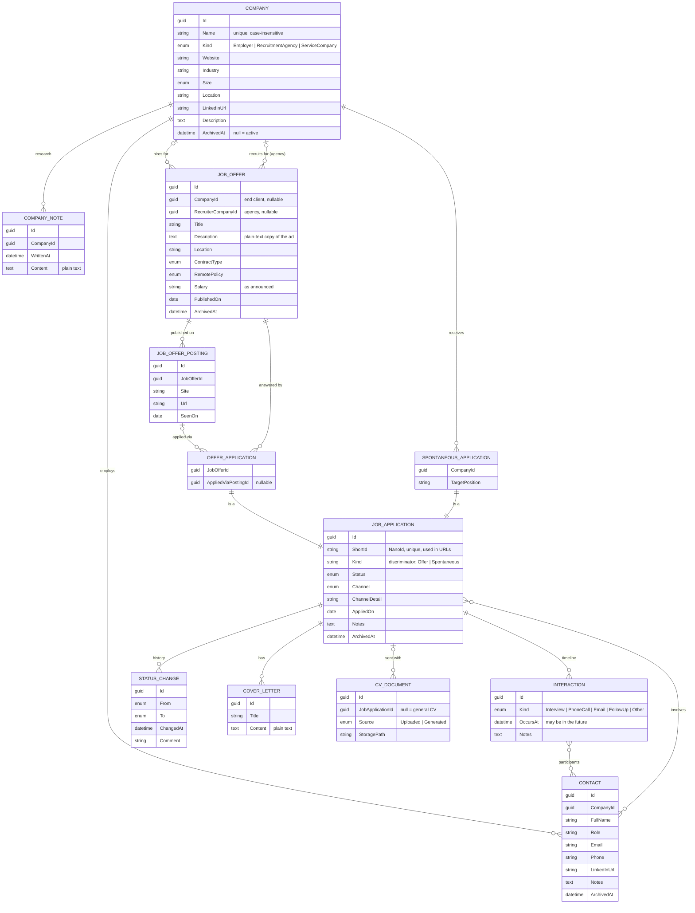

# Data model

This page details the entities behind application tracking. The layering rules (persistence-ignorant domain, mapping classes, DTOs) are in [architecture.md](architecture.md). The reasons for this model are in [ADR 0011](adr/0011-company-centric-model-with-job-offers.md) and [ADR 0012](adr/0012-archive-instead-of-delete.md).

> Status: the core (companies, offers, postings, applications, statuses, cover letters, uploaded CVs) lands in [Phase 1](roadmap.md#phase-1--application-tracking-mvp). Research notes, contacts, recruiters and interactions land in [Phase 2b](roadmap.md#phase-2b--company-research--contacts).

## Overview

The **company** is the anchor. The same company can publish several **job offers** over time, and the research done on it (profile, dated notes, contacts) is kept across all of them. An offer can be published on several sites (**postings**) and can exist without any application (market watch). An **application** targets either an offer or, when it's spontaneous, a company directly.



`OFFER_APPLICATION` and `SPONTANEOUS_APPLICATION` are subtypes of `JOB_APPLICATION`, stored in the same table (see [Application hierarchy](#application-hierarchy)). Every entity also has `CreatedAt` and `UpdatedAt`, which are left out of the diagram.

## Entities

### Company

A company profile that is kept across applications.

- `Kind`:
  - `Employer`: the company that hires.
  - `RecruitmentAgency`: a recruitment firm hiring on behalf of a client.
  - `ServiceCompany`: an IT services company (ESN) that places consultants with clients.
- `Name` is unique, compared case-insensitively (`COLLATE NOCASE`).
- `Size` is a range (`1-10`, `11-50`, `51-250`, `251-1000`, `1000+`).

### CompanyNote

Dated research notes written in plain text, such as "culture, tech stack, feedback from former employees, what was said in the first interview". They are shown as a timeline on the company page, newest first. They are deleted with their company.

### Contact

A person at a company: a recruiter, manager or interviewer. A contact belongs to one company and can be linked to several applications and interactions.

Contacts are **optional**. Many applications go through a website form and have no contact at all. A contact can be added later, for example when a recruiter calls back.

### JobOffer

A job ad, independent of whether you apply to it.

- `CompanyId` is the end client. `RecruiterCompanyId` is the agency or ESN that published the offer. **At least one** of the two is set, because an agency often hides its client.
- `Description` is a plain-text copy of the ad, so it survives when the ad goes offline.
- `ContractType`: `Permanent` (CDI), `FixedTerm` (CDD), `Freelance`, `Internship`, `Apprenticeship`, `Other`.
- `RemotePolicy`: `OnSite`, `Hybrid`, `FullRemote`, `Unknown`.
- `Salary` is free text, kept as announced ("45–55 k€", "TJM 500").

### JobOfferPosting

The same offer is often published on several sites. Each place it was seen is a posting: `Site` (LinkedIn, Indeed, Welcome to the Jungle, the company's careers page…), `Url` and `SeenOn`.

- `Url` is unique per offer.
- A dead link doesn't lose the offer.
- Before an offer is created, the UI suggests existing offers from the same company with a similar title, so a new posting can be added to an existing offer instead of creating a duplicate.

### Application hierarchy

`JobApplication` is an **abstract** base class with two subtypes:

| Type | Specific fields | Meaning |
|---|---|---|
| `OfferApplication` | `JobOfferId` (required), `AppliedViaPostingId` (optional) | Answer to a job offer. The company comes from the offer. The posting records which site's form was used, and must belong to the offer. |
| `SpontaneousApplication` | `CompanyId` (required), `TargetPosition` (required) | Application sent to a company without any offer. |

The base class carries everything they share:

- `Status` and its `StatusChange` history.
- `Channel`, how the application was sent:
  - `OnlineForm`: a job board or careers site form.
  - `Email`.
  - `Referral`.
  - `InPerson`.
  - `Other`.
- `ChannelDetail`: free text, such as a generic address like `jobs@…` or the name of the person who referred you.
- `AppliedOn`, which is null while the application is a draft.
- `Notes`.
- The cover letters, CVs, interactions and contacts.

**URL: short id + slug**. Each application has a `ShortId`: a short random string generated with [NanoId](https://github.com/codeyu/nanoid-net), stored as `TEXT` with a unique index. The application's URL is built from it:

```text
/applications/482913-backend-developer-acme
              └─────┘ └────────────────────┘
              ShortId  slug (title + company)
```

- The **short id** identifies the application. It keeps two applications with the same title (the same job applied to twice, or the same title at two companies) apart.
- The **slug** makes the URL readable. It isn't stored: it's computed from the title (offer title or `TargetPosition`) and the effective company name. A `Slug.From(...)` helper in Application lowercases, removes accents, replaces anything that isn't a letter or digit with `-`, and truncates to 60 characters.
- The page looks the application up by `ShortId` only. When the slug in the URL doesn't match the current one (the title changed, the link was mistyped), the page redirects to the canonical URL, so old links keep working.
- The short id is **random rather than sequential**, so the URL doesn't reveal how many applications exist ([ADR 0013](adr/0013-guid-v7-primary-keys.md)).
- **Generation**: the creating service in Infrastructure calls `Nanoid.Generate(alphabet, size)`. The domain doesn't depend on the library: it receives the value. The service retries while the id is already taken, and the unique index is the final guard.
- **Alphabet and size** are a single setting (`ShortIdOptions`):
  - It starts **numeric**: alphabet `0123456789`, size 6, so 10⁶ values.
  - It can move to **alphanumeric** (`0123456789abcdefghijklmnopqrstuvwxyz`, 36⁶ ≈ 2 billion values) without a migration, because the column is already text and existing ids stay valid.
  - The alphabet must **never contain `-`**, because the first `-` separates the short id from the slug. This is why NanoId's default alphabet (which contains `-` and `_`) isn't used. Lowercase only, so URLs stay consistent.
- `Guid Id` remains the primary key and the target of every foreign key. `ShortId` is only an alternate identifier for navigation.

**Status workflow**: `Draft → Applied → Interview → Offer / Rejected / Withdrawn`. Every transition is checked by the domain and recorded as a `StatusChange`.

**Effective company** of an application:
- For an `OfferApplication`, `JobOffer.CompanyId` if it's known, otherwise `JobOffer.RecruiterCompanyId`.
- For a `SpontaneousApplication`, `CompanyId`.

### StatusChange

`From`, `To`, `ChangedAt` and an optional `Comment`. These rows are append-only and are deleted with their application.

### Interaction

Dated events of an application: `Interview`, `PhoneCall`, `Email`, `FollowUp`, `Other`.

- `OccursAt` can be in the future, which is how upcoming interviews appear on the dashboard.
- The participants are contacts.
- Interactions are deleted with their application.

### CoverLetter and CvDocument

- Cover letters are plain text, with 1..n per application.
- `CvDocument` is the metadata of a CV file (uploaded or generated). With `JobApplicationId = null`, it's a general CV. See [architecture.md](architecture.md#data-model) and [ADR 0007](adr/0007-cv-snapshots-selection-and-override.md).

### UserSettings

A single row of preferences for the account ([ADR 0002](adr/0002-single-user-application.md)), edited on the Settings page ([ui.md](ui.md#screens)). It's not linked to the other entities, so it's left out of the diagram.

- `FollowUpAfterDays` (default `7`): an application still `Applied` after this many days, with no status change, appears in **Follow up** on the dashboard.
- The theme isn't stored here: it's a per-browser choice kept in `localStorage`.
- Language joins it in [Phase 5](roadmap.md#phase-5--identity--i18n).

## Relationships and deletion

Rows are **archived** (`ArchivedAt`) instead of deleted ([ADR 0012](adr/0012-archive-instead-of-delete.md)). A hard delete is only possible when nothing references the row.

| Relationship | On delete of the parent |
|---|---|
| Company → CompanyNote | Cascade |
| Company → Contact | Restrict |
| Company → JobOffer (client and recruiter) | Restrict |
| Company → SpontaneousApplication | Restrict |
| JobOffer → JobOfferPosting | Cascade |
| JobOffer → OfferApplication | Restrict |
| JobOfferPosting → OfferApplication (applied via) | Set null |
| JobApplication → StatusChange, CoverLetter, Interaction | Cascade |
| JobApplication → CvDocument | Restrict: the service deletes the files first, then the rows |
| JobApplication ↔ Contact, Interaction ↔ Contact | Cascade on the join rows only |

## Persistence

### Application hierarchy: TPH

The application hierarchy is mapped as **table-per-hierarchy** (EF Core's default).

- There is a single `JobApplications` table with a `Kind` discriminator column (`Offer` | `Spontaneous`).
- `JobApplicationConfiguration` declares the discriminator:

  ```csharp
  builder.HasDiscriminator<string>("Kind")
      .HasValue<OfferApplication>("Offer")
      .HasValue<SpontaneousApplication>("Spontaneous");
  ```

- `OfferApplicationConfiguration` and `SpontaneousApplicationConfiguration` configure the specific columns. The domain classes stay plain C#.
- The subtype columns are nullable in SQL, so a check constraint restores integrity:

  ```sql
  (Kind = 'Offer' AND JobOfferId IS NOT NULL AND CompanyId IS NULL)
  OR (Kind = 'Spontaneous' AND CompanyId IS NOT NULL AND JobOfferId IS NULL AND TargetPosition IS NOT NULL)
  ```

EF Core supports three inheritance mapping strategies ([docs](https://learn.microsoft.com/ef/core/modeling/inheritance)):

| Strategy | Tables | Reading "all applications" | Trade-off |
|---|---|---|---|
| **TPH** — table-per-hierarchy | One table for the whole hierarchy, with a discriminator column | A single `SELECT`, no join | Subtype columns are nullable in SQL |
| **TPT** — table-per-type | One table for the base type plus one per subtype, which holds only its own columns and shares the key | A join between the base table and every subtype table | Slowest reads, and every insert writes to two tables |
| **TPC** — table-per-concrete-type | One full table per concrete subtype (base columns repeated), none for the abstract base | A `UNION` of every subtype table | Keys must be unique across tables, and foreign keys to the base type (from `StatusChange`, `CoverLetter`, `Interaction`…) can't be enforced by the database |

TPH was chosen because the most frequent query, "all my applications" (list and dashboard), then needs no join and no `UNION`. Also, the many entities that point to `JobApplication` keep a real foreign key to a single table.

### Keys: GUID v7 rather than auto-increment integers

Every entity uses a `Guid` key created by the domain with `Guid.CreateVersion7()`. Keys are not `INTEGER` columns incremented by the database. The reasons:

- **Identity at construction**: an entity has its id as soon as it is created, before `SaveChangesAsync`. The domain factories (`JobApplication`, `JobOffer`…) can build a whole graph (offer, postings, application) and reference ids without a database round trip. Services can also return the new id without reloading.
- **File names**: a stored document is named after its id (`documents/<yyyy>/<id>.pdf`), so the file can be written before the row is saved and there are no name clashes.
- **Export and import** ([Phase 6](roadmap.md#phase-6--data--showcase)): ids stay unique across Postulo instances. Importing an export into an instance that already has data doesn't collide with existing rows or require any id remapping.
- **Demo seeding**: the demo data can use fixed, known ids.
- **Non-guessable URLs**: `/applications/3` would reveal the number of applications, for example in screenshots or on the public demo. A GUID doesn't.

**Why version 7**: a v7 GUID starts with a millisecond timestamp. Unlike a random v4 GUID, new keys are appended at the end of the index instead of being spread across it, which keeps inserts efficient. Rows can also be sorted by creation order using the key alone.

**Costs**:
- The SQLite provider stores a `Guid` as 36-character `TEXT`, versus at most 8 bytes for an integer.
- Ids are harder to read when debugging.

At the data volume of a single user, both costs are negligible.

**Mapping**: since the domain generates the key, the mapping classes declare `Property(e => e.Id).ValueGeneratedNever()`. Identity tables keep the template's `string` keys.

### Conventions

| Concern | Convention |
|---|---|
| Keys | `Guid` v7 (`Guid.CreateVersion7()`), generated by the domain (see [above](#keys-guid-v7-rather-than-auto-increment-integers)) |
| Timestamps | UTC `DateTime`. The SQLite provider can't order or compare `DateTimeOffset`. |
| Calendar dates | `DateOnly` (`AppliedOn`, `PublishedOn`, `SeenOn`) |
| Enums | Stored as strings (`HasConversion<string>()`): readable in the database and stable in the JSON export |
| `CreatedAt` / `UpdatedAt` | Set by a `SaveChangesInterceptor` in Infrastructure |
| Archived rows | Filtered out by the services with an explicit `Where`. There is no global query filter, so an archived company still shows up in the history of its old applications. |
| Many-to-many | Configured with `UsingEntity` in the mapping classes (`ApplicationContacts`, `InteractionParticipants`). The domain has no join-entity classes. |

### DTOs

- **Lists** use one flat `JobApplicationSummaryDto` (`Id`, `Kind`, `Title`, `CompanyName`, `RecruiterName`, `Status`, `AppliedOn`), projected in LINQ so EF builds a single query:

  ```csharp
  Title = a is OfferApplication o ? o.JobOffer.Title : ((SpontaneousApplication)a).TargetPosition
  ```

- Summary and detail DTOs carry `ShortId` and the computed `Slug`, so links are built without another query.
- **Details** use one DTO per subtype: `OfferApplicationDetailsDto` and `SpontaneousApplicationDetailsDto`.

## Common queries

- **Everything about a company**: its offers (as client or recruiter), their applications, its spontaneous applications, its notes and contacts. Applications are found with `a is OfferApplication o ? (o.JobOffer.CompanyId == id || o.JobOffer.RecruiterCompanyId == id) : ((SpontaneousApplication)a).CompanyId == id`.
- **Upcoming interviews**: `Interactions` where `OccursAt >= now`, ordered by `OccursAt`, for applications that aren't archived.
- **Applications per site**: `OfferApplication` grouped by `AppliedViaPosting.Site`.
